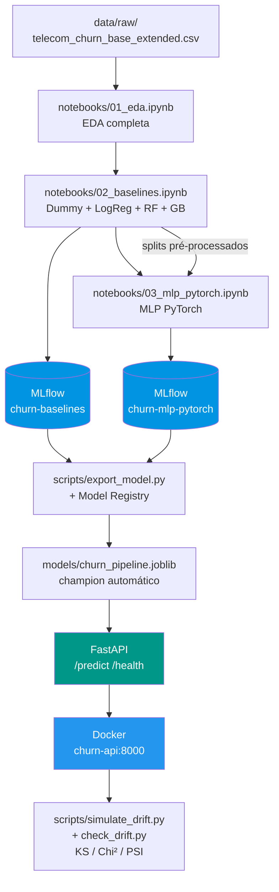
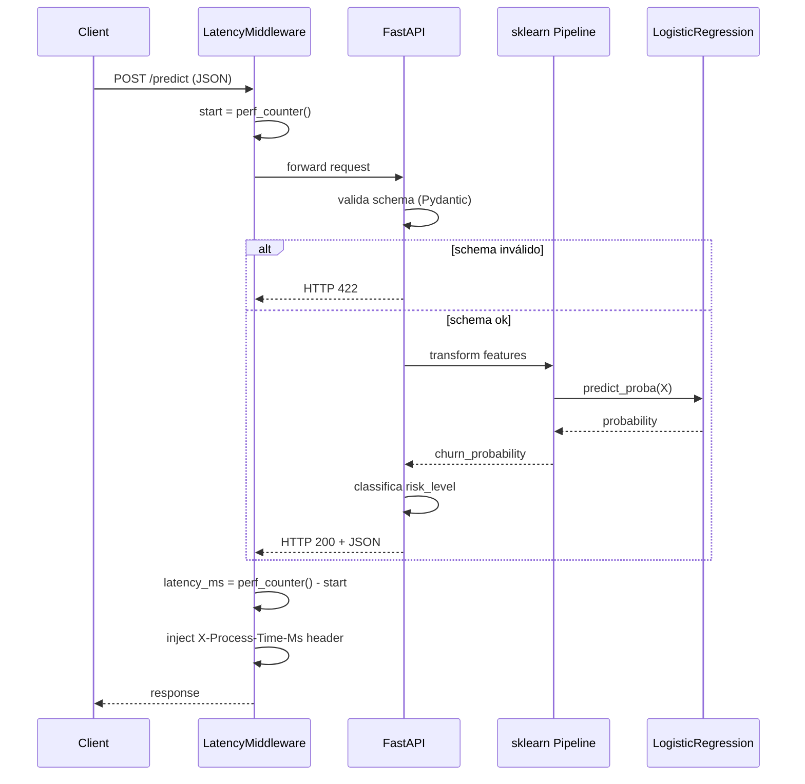

# Predição de Churn em Telecom — Tech Challenge (Grupo 4)

[](https://www.python.org/)
[](https://pytorch.org/)
[](https://fastapi.tiangolo.com/)
[](https://mlflow.org/)
[](https://scikit-learn.org/)
[](https://docs.astral.sh/ruff/)
[](tests/)
[](LICENSE)

Projeto de Machine Learning para prever churn em telecom, com pipeline robusto, automação, rastreabilidade e foco em métricas de negócio.

## Arquitetura do pipeline



## Fluxo de requisição na API



## Status atual

- EDA executável e documentada
- Baselines: `DummyClassifier`, `LogisticRegression`, `RandomForest`, `GradientBoosting` com fairness (Fairlearn)
- Pipeline MLP em PyTorch com rastreabilidade no MLflow
- Métricas de negócio integradas (clientes abordados, valor líquido, ROI)
- Automação fim a fim via Makefile (`run-all`, `analyze`, `mlflow-up/down`)
- **Pipeline reutilizável** em `src/churn_prediction/` (refatorado dos notebooks)
- **API FastAPI** com endpoints `/predict` e `/health` (Pydantic schemas)
- **Dockerfile + docker-compose** para deploy containerizado
- **Model Registry** com seleção automática do champion por métrica de negócio (`valor_liquido`)
- **Testes automatizados** (36 testes: smoke, schema, API, registry)
- **CI/CD** com GitHub Actions (lint, testes, treinamento, build Docker)
- **Monitoramento de drift** (KS test, Chi², PSI) com simulação
- Documentação técnica e de negócio atualizada

## 1. Objetivo

- Estimar a probabilidade de churn por cliente
- Priorizar campanhas de retenção com base em risco e valor
- Medir impacto com métricas técnicas (AUC-ROC, PR-AUC, F1) e de negócio (churn evitado, valor líquido, ROI)

## 2. Pipeline e notebooks

- `01_eda.ipynb`: Exploração e análise dos dados
- `02_baselines.ipynb`: Baselines lineares e de árvore (`Dummy`, `LogReg`, `RandomForest`, `GradientBoosting`), fairness, métricas de negócio, MLflow; exporta splits
- `03_mlp_pytorch.ipynb`: MLP em PyTorch com BatchNorm, Dropout, early stopping, batching, Feature Importance via RF e GB, comparação vs. todos os baselines (lineares + árvores + MLP), análise de custo por threshold e MLflow; resolução dinâmica de paths (compatível com VS Code, Jupyter e `make`)

## 3. Dataset principal

Base: `data/raw/telecom_churn_base_extended.csv`

O dataset é sintético, com problemas controlados de qualidade (duplicidades, missing, inconsistências) para simular um cenário realista. Inclui variáveis de perfil, uso, financeiro, atendimento e satisfação.

Colunas-chave de saída:

- `churn` (target binário)

Importante:

- `churn` é a variável alvo usada nos baselines.

## 4. Estrutura do repositório

```text
mlet-grupo4-tech-challenge/
├── .github/workflows/
│   └── ci_ml_pipeline.yml       # CI/CD: lint, testes, treino, Docker
├── data/
│   ├── raw/                     # CSVs brutos (sintéticos)
│   ├── interim/                 # Artefatos intermediários
│   └── processed/               # Splits processados
├── docs/
│   ├── ml_canvas.md
│   ├── model_card.md
│   ├── eda_metodologia.md
│   └── fase1_doc_tecnica.md
├── notebooks/
│   ├── 01_eda.ipynb
│   ├── 02_baselines.ipynb
│   └── 03_mlp_pytorch.ipynb
├── scripts/
│   ├── analyze_mlruns.py        # Análise de runs MLflow
│   ├── export_model.py          # Seleciona champion e exporta pipeline
│   ├── simulate_drift.py        # Simula data drift na API
│   ├── check_drift.py           # Analisa drift treino vs produção
│   ├── generate_synthetic.py    # Gera dataset sintético
│   └── logging_utils.py
├── src/churn_prediction/
│   ├── config.py                # Constantes e hiperparâmetros
│   ├── data_cleaning.py         # Limpeza de dados
│   ├── preprocessing.py         # Pipeline sklearn (imputer+scaler+OHE)
│   ├── evaluation.py            # Métricas técnicas e de negócio
│   ├── model.py                 # MLP PyTorch
│   ├── monitoring.py            # Drift detection (KS, Chi², PSI)
│   ├── registry.py              # Model Registry: seleção e exportação do champion
│   ├── api/
│   │   ├── main.py              # FastAPI app (/predict, /health)
│   │   └── schemas.py           # Pydantic schemas
│   └── pipelines/
│       └── __init__.py          # Orquestração prepare_data → train
├── tests/
│   ├── test_smoke.py            # Imports dos módulos
│   ├── test_schema.py           # Validação Pydantic + data cleaning
│   ├── test_api.py              # Endpoints com mocks
│   └── test_registry.py         # Seleção e exportação do champion
├── Dockerfile
├── docker-compose.yml
├── pyproject.toml
└── README.md
```

## 5. Model Registry e seleção do champion

O projeto implementa seleção automática do melhor modelo via MLflow Model Registry.

### 5.1 Como funciona

O script `export_model.py` consulta **todos os experimentos** no MLflow (baselines + MLP), rankeia os modelos por **`valor_liquido`** (métrica de negócio) com desempate por **`roc_auc`**, e exporta o vencedor:

```bash
PYTHONPATH=src poetry run python scripts/export_model.py
```

Saída:
```
Champion selecionado: mlp_pytorch_v1 (run_id=7d2323f7) | valor_liquido=1194000.00 | roc_auc=0.8772
============================================================
CHAMPION: mlp_pytorch_v1
  valor_liquido: 1194000.0000
  roc_auc: 0.8772
------------------------------------------------------------
Candidatos avaliados:
  1. mlp_pytorch_v1 | valor_liquido=1194000 | roc_auc=0.8772
  2. log_reg | valor_liquido=1190800 | roc_auc=0.8783
  3. gradient_boosting | valor_liquido=1183300 | roc_auc=0.8815
  4. random_forest | valor_liquido=1103750 | roc_auc=0.8609
============================================================
```

### 5.2 Artefatos gerados

| Arquivo | Descrição |
|---------|-----------|
| `models/churn_pipeline.joblib` | Pipeline serializável (sklearn ou PyTorch wrapper) |
| `models/champion_metadata.json` | Metadados: run_id, métricas, dataset_version, candidatos |

### 5.3 champion_metadata.json

O arquivo responde às perguntas do ciclo de vida do modelo:

| Pergunta | Campo no JSON |
|----------|---------------|
| Qual versão está em produção? | `champion_run_id` + `champion_run_name` |
| Quais parâmetros foram usados? | `metrics` + `dataset_version` |
| Como voltar para a versão anterior? | `all_candidates` (lista rankeada com run_ids) |

### 5.4 Critério de seleção

- **Métrica primária:** `valor_liquido = TP × R$500 − (TP + FP) × R$50`
- **Desempate:** `roc_auc`
- **Justificativa:** O Tech Challenge exige métrica de negócio (custo de churn evitado) e análise de trade-off de custo (FP vs FN). O `valor_liquido` captura ambos.

### 5.5 Suporte a modelos PyTorch

Quando o MLP é o champion, o registry empacota o modelo PyTorch + preprocessor sklearn em um `PyTorchChurnWrapper` que expõe a interface `predict()` / `predict_proba()`. A API não precisa saber o flavor do champion.

## 6. Automação e rastreabilidade

- **Makefile**: targets para rodar EDA, baselines, MLP, análise e MLflow
- **MLflow**: rastreia experimentos, parâmetros, métricas técnicas e de negócio

## 7. Ambiente e instalacao

Pre-requisitos:

- Python 3.11+ (recomendado 3.12)
- Poetry
- Docker Desktop (para containerizacao — opcional para desenvolvimento local)

Dependencias-chave para a etapa de fairness:

- `scikit-learn >=1.5,<1.6`
- `fairlearn ^0.11.0`

Instalacao:

```bash
git clone https://github.com/Janoti/mlet-grupo4-tech-challenge.git
cd mlet-grupo4-tech-challenge
poetry install
```

Opcional com Makefile:

```bash
make install
```

## 7.1 Atalhos com Makefile

Comandos para executar notebooks e iniciar MLflow com logs de progresso no terminal:

```bash
make help
make run-all
make notebooks
make notebooks-eda
make notebooks-baselines
make notebooks-mlp
make analyze
make mlflow
make mlflow-up
make mlflow-down
make mlflow-clean
```

Execucao recomendada (fim a fim):

```bash
make install
make run-all
```

O `make run-all` executa estes steps automaticamente:

1. Limpa `mlruns/`.
2. Executa `notebooks/01_eda.ipynb`.
3. Executa `notebooks/02_baselines.ipynb` (exporta splits preprocessados para `data/processed/`).
4. Executa `notebooks/03_mlp_pytorch.ipynb` (MLP com early stopping, métricas e MLflow).
5. Le os runs em `mlruns/` e imprime analise resumida (baselines + MLP).
6. Sobe MLflow em background e mostra o link.

Saidas esperadas no terminal:

- `make notebooks`:
	- `[notebooks-eda] Iniciando execucao de notebooks/01_eda.ipynb...`
	- `[notebooks-eda] Concluido.`
	- `[notebooks-baselines] Iniciando execucao de notebooks/02_baselines.ipynb...`
	- `[notebooks-baselines] Concluido.`
	- `[notebooks-mlp] Iniciando execucao de notebooks/03_mlp_pytorch.ipynb...`
	- `[notebooks-mlp] Concluido.`
	- `[notebooks] Execucao completa finalizada.`
- `make analyze`:
	- `[analysis] Resumo automatico da run`
	- metricas de `dummy_stratified`, `log_reg` e `log_reg_mitigated_equalized_odds`
	- deltas de performance e leitura sugerida para apresentacao
	- resumo da metrica de negocio (`tp`, `fp`, `clientes_abordados`, `valor_liquido`, `valor_por_cliente`)
	- aviso quando algum run esperado ainda nao existe no `mlruns/`
- `make mlflow`:
	- `[mlflow] Subindo MLflow UI em http://127.0.0.1:5000`
- `make mlflow-up`:
	- `[mlflow] PID: ...`
	- `[mlflow] Link: http://127.0.0.1:5000`

Observacao:

- A execucao dos notebooks usa `nbconvert --execute --inplace`, entao as celulas ficam com outputs salvos no proprio arquivo `.ipynb`.
- Para reduzir warnings de IOPub no `nbconvert`, o Makefile usa timeout maior e nivel de log configuravel (`IOPUB_TIMEOUT` e `NB_LOG_LEVEL`).

Padrao de logs dos scripts Python:

- Os scripts usam logging padronizado com formato unico (`timestamp | level | logger | mensagem`).
- Para controlar verbosidade, use a variavel `LOG_LEVEL` (ex.: `LOG_LEVEL=DEBUG make analyze`).
- Scripts com logging padronizado nesta branch: `scripts/generate_dataset.py` e `scripts/analyze_mlruns.py`.

## 8. Geracao dos dados

### Base estendida (recomendada)

```bash
poetry run python scripts/generate_synthetic.py --n-rows 50000 --seed 42 --out-dir data/raw
```

O script da base estendida agora simula problemas de qualidade de dados. Por padrao, ele injeta:

- duplicidade de linhas
- duplicidade de identificadores
- missing adicional em colunas selecionadas
- valores fora de faixa e categorias invalidas

Exemplo com parametrizacao explicita:

```bash
poetry run python scripts/generate_synthetic.py \
	--n-rows 50000 \
	--seed 42 \
	--out-dir data/raw \
	--duplicate-row-rate 0.03 \
	--duplicate-id-rate 0.02 \
	--missing-noise-rate 0.01 \
	--invalid-value-rate 0.01
```

Arquivo gerado:

- `data/raw/telecom_churn_base_extended.csv`

### Base simplificada (legado)

```bash
poetry run python scripts/generate_dataset.py --n-rows 50000 --seed 42 --out-dir data/raw
```

Arquivo gerado:

- `data/raw/telecom_churn_base.csv`

## 9. Fluxo recomendado

1. Gerar/validar dataset em `data/raw`.
2. Executar exploracao e diagnostico em `notebooks/01_eda.ipynb`. O EDA inclui analise de correlacao entre features numericas: foram identificados **14 pares com |r| > 0.7**, sendo os mais criticos:
	- `price_increase_last_3m` ↔ `invoice_shock_flag` (r = 0.99)
	- `avg_bill_last_6m` ↔ `monthly_charges` (r = 0.97)
	- `data_gb_monthly` ↔ `avg_usage_last_3m` (r = 0.97)
	- `late_payments_6m` ↔ `default_flag` (r = 0.92)

	Pares com |r| > 0.9 representam informacao redundante e devem ser consolidados, especialmente para modelos sensiveis a multicolinearidade como a regressao logistica.
3. No proprio EDA da Fase 1, aplicar tratamento minimo para baseline:
	- remocao de duplicados
	- correcao de valores invalidos
	- imputacao simples
	- one-hot encoding das categoricas
4. Separar os dados em treino e teste com split estratificado `80/20`.
5. Treinar baselines com `DummyClassifier` e `LogisticRegression` no notebook `notebooks/02_baselines.ipynb`.
6. Tunar hiperparametros com `GridSearchCV` (5-fold estratificado) variando `C` em [0.001, 0.01, 0.1, 1, 10, 100] e comparar penalidades L1, L2 e ElasticNet. Melhor configuracao encontrada: `C=0.1` com L2 (diferenca entre penalidades < 0.0002 em ROC-AUC).
7. Otimizar threshold de classificacao por metrica de negocio (valor liquido da campanha de retencao), varrendo thresholds de 0.10 a 0.90.
8. Registrar experimentos no MLflow (parametros, metricas e versao do dataset).
9. Avaliar fairness por subgrupos com Fairlearn (`gender`, `age_group`, `region` e `plan_type`).
10. Aplicar mitigacao opcional com `EqualizedOdds` e comparar trade-offs (a versao atual do notebook usa configuracao otimizada para tempo de execucao).
11. Consolidar resultados em `docs/model_card.md`.
12. Revisar premissas de negocio (`V_RETIDO`, `C_ACAO`) com stakeholders para calibrar decisao operacional.

Tratamento adotado na Fase 1:

- Numericas: imputacao por mediana.
- Categoricas: imputacao por moda.
- Categoricas finais: transformacao com one-hot encoding.
- Exclusoes por leakage: `customer_id`, `churn_probability`, `retention_offer_made`, `retention_offer_accepted`, `contract_renewal_date`, `loyalty_end_date`.

Split adotado:

- Treino: `80%`
- Teste: `20%`
- Estratificacao pelo target `churn`

Fairness e rastreabilidade:

- Diagnostico inicial no EDA por subgrupos sensiveis.
- Avaliacao no baseline com Fairlearn (`demographic_parity_difference`, `equalized_odds_difference`).
- Mitigacao de referencia com `ExponentiatedGradient` + `EqualizedOdds`.
- Registro no MLflow com versao do dataset baseada em hash (`dataset_version`).

Metrica de negocio (status atual):

- Ja registrada automaticamente no MLflow para `dummy_stratified`, `log_reg` e `log_reg_mitigated_equalized_odds`.
- Formula operacionalizada no notebook:
	- `valor_liquido = TP * V_RETIDO - (TP + FP) * C_ACAO`
	- `valor_por_cliente = valor_liquido / N`
- Campos consolidados e analisados em `make analyze`:
	- `tp`, `fp`, `clientes_abordados`, `valor_bruto`, `custo_total_acao`, `valor_liquido`, `valor_por_cliente`

## 10. Qualidade de codigo

Lint:

```bash
poetry run ruff check src scripts tests
```

Auto-fix:

```bash
poetry run ruff check src scripts tests --fix
```

Testes:

```bash
poetry run pytest -q                              # resumido
poetry run pytest tests/ -v                       # verbose (todos)
poetry run pytest tests/test_api.py -v            # apenas testes da API
poetry run pytest tests/test_schema.py::TestDataCleaning -v  # classe especifica
```

## 11. MLflow (opcional local)

```bash
poetry run mlflow ui --backend-store-uri ./mlruns
```

Ou via Makefile:

```bash
make mlflow
```

Abrir em http://127.0.0.1:5000

Se a porta 5000 estiver em uso, rode em outra porta:

```bash
MLFLOW_PORT=5001 make mlflow
```

## 12. Documentacao

- Canvas de negocio e modelagem: `docs/ml_canvas.md`
- Explicacao da EDA e das escolhas metodologicas: `docs/eda_metodologia.md`
- Documento tecnico consolidado da Fase 1 (EDA + baseline + automacao): `docs/fase1_doc_tecnica.md`
- Card do modelo: `docs/model_card.md`

## 13. API de inferência (FastAPI)

A API expõe o modelo treinado para predições em tempo real.

### 13.1 Passo a passo para rodar localmente

```bash
# 1. Gerar dados (se ainda não existem)
poetry run python scripts/generate_synthetic.py --n-rows 50000 --seed 42 --out-dir data/raw

# 2. Exportar pipeline treinado (salva em models/churn_pipeline.joblib)
PYTHONPATH=src poetry run python scripts/export_model.py

# 3. Rodar a API (porta 8000)
PYTHONPATH=src poetry run uvicorn churn_prediction.api.main:app --reload --port 8000

# 4. Acessar documentação interativa
#    Swagger UI: http://localhost:8000/docs
#    ReDoc:      http://localhost:8000/redoc
```

### 13.2 Passo a passo via Docker

```bash
# 1. Exportar modelo (necessário antes do build)
PYTHONPATH=src poetry run python scripts/export_model.py

# 2. Build e start do container
docker compose up --build churn-api

# A API fica disponível em http://localhost:8000
```

### 13.3 Testar a API

```bash
# Health check
curl http://localhost:8000/health

# Predição de churn
curl -X POST http://localhost:8000/predict \
  -H "Content-Type: application/json" \
  -d '{"age": 45, "gender": "female", "plan_type": "pos", "monthly_charges": 120, "nps_score": 3}'
```

Resposta esperada:

```json
{
  "churn_probability": 0.6823,
  "churn_prediction": 1,
  "risk_level": "medio",
  "model_version": "mlp_pytorch_v1"
}
```

### 13.4 Endpoints

| Método | Rota | Descrição |
|--------|------|-----------|
| `GET` | `/` | Informações gerais da API |
| `GET` | `/health` | Status da API e do modelo carregado |
| `POST` | `/predict` | Predição de churn (probabilidade, classe, risco) |
| `GET` | `/docs` | Swagger UI (documentação interativa) |
| `GET` | `/redoc` | ReDoc (documentação formatada) |

Observações:
- Todos os campos de entrada são opcionais (o pipeline imputa valores ausentes)
- Campos inválidos retornam HTTP 422 com detalhes do erro (validação Pydantic)
- A variável `CHURN_MODEL_PATH` permite apontar para outro modelo serializado

## 14. Monitoramento de drift

### 14.1 Passo a passo para simulação de drift

Pré-requisito: a API deve estar rodando (seção 13).

```bash
# 1. Garantir que a API está no ar
curl http://localhost:8000/health

# 2. Enviar requisições com distribuição alterada (age +10, charges +30%)
poetry run python scripts/simulate_drift.py --url http://localhost:8000 --n-requests 100

# Os resultados são salvos em logs/drift_simulation.jsonl
```

### 14.2 Análise de drift

```bash
# Compara dados de treino com logs de produção
PYTHONPATH=src poetry run python scripts/check_drift.py \
  --reference data/raw/telecom_churn_base_extended.csv \
  --production logs/drift_simulation.jsonl
```

Saída esperada:

```
======================================================================
RELATÓRIO DE DATA DRIFT
======================================================================
Features analisadas: 15
Alertas de drift: 3
Razão de drift: 20.0%
----------------------------------------------------------------------
  ⚠ DRIFT | age                            | kolmogorov_smirnov   | p=0.0001 PSI=0.2541 ⚠ PSI>0.20
  ⚠ DRIFT | monthly_charges                | kolmogorov_smirnov   | p=0.0003 PSI=0.1872
    OK     | nps_score                      | kolmogorov_smirnov   | p=0.4521 PSI=0.0123
======================================================================
```

### 14.3 Testes estatísticos utilizados

| Teste | Tipo de feature | Interpretação |
|-------|----------------|---------------|
| **KS (Kolmogorov-Smirnov)** | Numéricas | p < 0.05 → drift detectado |
| **Chi² (Qui-Quadrado)** | Categóricas | p < 0.05 → drift detectado |
| **PSI** | Numéricas | < 0.10 OK · 0.10-0.20 investigar · > 0.20 retreinar |

## 15. CI/CD (GitHub Actions)

Pipeline automatizado em `.github/workflows/ci_ml_pipeline.yml`:
1. **Quality**: lint (ruff) + pytest em todo push/PR
2. **Train**: gera dados → seleciona champion → exporta modelo (apenas main)
3. **Docker**: valida build da imagem (apenas main)

## 16. Proximos passos

1. Calibrar os parametros de negocio (`V_RETIDO`, `C_ACAO`) com time de CRM/financas.
2. Definir corte operacional por top-K para retencao.
3. Implementar retreinamento automático via trigger de drift (CT).
4. Adicionar autenticação JWT à API (conforme Cap. 5 do material).
5. Deploy em cloud (Render, AWS, Azure) com autoscaling.
6. Integrar SHAP/LIME para explainability do modelo.

## 17. Resultados dos Baselines e Interpretação

### 17.1 Desempenho dos modelos

| Modelo                        | Accuracy | F1    | ROC-AUC | PR-AUC | Valor Líquido    |
|-------------------------------|----------|-------|---------|--------|------------------|
| `dummy_stratified`            | 0.5294   | 0.3937| 0.5046  | 0.3959 | R$ 561.850       |
| `log_reg` (C=1)               | 0.8069   | 0.7425| 0.8783  | 0.8480 | **R$ 1.190.800** |
| `log_reg_best_penalty` (C=0.1)| 0.8069   | 0.7425| 0.8784  | 0.8480 | R$ 1.190.800     |
| `log_reg_mitigated_equalized_odds` | 0.8007 | 0.7352|   --   |   --   | R$ 1.180.950     |

**Interpretação:**
- O DummyClassifier serve como referência mínima, com métricas próximas ao acaso.
- A Regressão Logística supera amplamente o dummy, com ROC-AUC de 0.878, indicando excelente capacidade discriminativa.
- O valor líquido representa o ganho operacional ao aplicar a política de retencao baseada no modelo.
- O modelo mitigado por fairness mantém performance próxima, com pequena perda de F1 e valor líquido, o que é esperado.

### 17.2 Diagnóstico de Overfitting

| Modelo         | delta_roc_auc (treino - teste) | Diagnóstico                        |
|---------------|-------------------------------|------------------------------------|
| `log_reg`     | 0.0013                        | Sem overfitting - generaliza bem   |
| `dummy_stratified` | -0.0085                   | OK (teste ligeiramente melhor)     |

**Interpretação:**
- O delta_roc_auc próximo de zero mostra que o modelo não está memorizando o treino e generaliza bem para novos dados.

### 17.3 Comparação de Penalizações (L1, L2, ElasticNet)

| Penalização | Melhor C | ROC-AUC CV | ROC-AUC Teste |
|-------------|----------|------------|---------------|
| L2 (Ridge)  | 0.1      | 0.8782     | 0.8783        |
| L1 (Lasso)  | 0.1      | 0.8783     | 0.8783        |
| ElasticNet  | 0.1      | 0.8783     | **0.8784**    |

**Interpretação:**
- As três penalizações convergem para C=0.1, com diferença < 0.0002 em ROC-AUC.
- Isso indica que o dataset está bem condicionado e não há ganho relevante em usar penalizações mais complexas.
- Mantém-se L2 como referência pela simplicidade.

### 17.4 Fairness por Grupo Sensível

#### `log_reg` (sem mitigação)

| Atributo sensível | dp_diff | eo_diff |
|-------------------|---------|---------|
| `gender`          | 0.0552  | 0.0741  |
| `age_group`       | 0.1101  | 0.0758  |
| `region`          | 0.1565  | 0.1672  |
| `plan_type`       | 0.2960  | 0.1840  |

- O maior gap está em `plan_type`, indicando risco regulatório de concentrar retencao em clientes pré-pagos.

#### `log_reg_mitigated_equalized_odds` (mitigação por `gender`)

| Métrica           | `log_reg` | Mitigado | Variação |
|-------------------|-----------|----------|----------|
| dp_diff_gender    | 0.0552    | 0.0518   | -6%      |
| eo_diff_gender    | 0.0741    | 0.0847   | +14%     |
| F1                | 0.7425    | 0.7352   | -0.007   |
| Valor Líquido     | R$ 1.190.800 | R$ 1.180.950 | -R$ 9.850 |

- A mitigacao reduz o gap de fairness para gênero, com custo operacional pequeno.
- Os gaps de outros atributos permanecem sem tratamento.

### 17.5 Métrica de Negócio

```
valor_liquido = TP x R$500 - (TP + FP) x R$50
```

- `log_reg`: **R$ 1.190.800** abordando 3.494 clientes (2.731 TP, 763 FP)
- `dummy_stratified`: 2.254 FP para apenas 1.499 acertos -> R$ 561.850
- Mitigacao custa apenas R$ 9.850 a menos — custo aceitável para redução de risco regulatório

**Resumo:**
O pipeline baseline entrega valor de negócio robusto, generaliza bem, e já considera fairness. Os resultados são realistas e prontos para apresentação ou evolução para modelos mais complexos.

## 18. Resultados do MLP e Comparação Completa

### 18.1 Desempenho comparativo (todos os modelos)

| Modelo               | Accuracy | F1     | ROC-AUC | PR-AUC | Valor Líquido    |
|----------------------|----------|--------|---------|--------|------------------|
| `dummy_stratified`   | 0.5294   | 0.3937 | 0.5046  | 0.3959 | R$ 561.850       |
| `random_forest`      | 0.7950   | 0.7154 | 0.8609  | 0.8225 | R$ 1.103.750     |
| `log_reg`            | 0.8069   | 0.7425 | 0.8783  | 0.8480 | R$ 1.190.800     |
| `gradient_boosting`  | 0.8137   | 0.7474 | 0.8815  | 0.8541 | R$ 1.183.300     |
| **`mlp_pytorch`**    | 0.8067   | 0.7427 | 0.8772  | 0.8464 | **R$ 1.192.700** |

**Interpretação:**
- O MLP supera todos os modelos em **valor líquido** (+R$ 9.400 vs. GradientBoosting), com performance técnica comparável.
- ROC-AUC e F1 do MLP ficam apenas 0.004 abaixo do GradientBoosting — diferença não significativa considerando o ganho operacional.
- O MLP confirma a robustez do pipeline: mesmo sem tuning extenso, atinge resultado competitivo.

### 18.2 Feature Importance (RF e Gradient Boosting)

Top features presentes no Top-10 de **ambos** os modelos (7 features consenso):

| Feature                        | Importância RF | Importância GB |
|-------------------------------|----------------|----------------|
| `nps_detractor_flag`          | 0.0976         | 0.1951         |
| `late_payments_6m`            | 0.0595         | 0.2152         |
| `cat__nps_category_detractor` | 0.0801         | 0.0901         |
| `invoice_shock_flag`          | 0.0536         | 0.0872         |
| `plan_price`                  | 0.0356         | 0.1033         |
| `price_increase_last_3m`      | 0.0518         | 0.0258         |
| `nps_promoter_flag`           | 0.0426         | 0.0331         |

**Interpretação:**
- Satisfação (`nps_detractor_flag`) e inadimplência (`late_payments_6m`) são os sinais mais fortes de churn.
- Choques financeiros (`invoice_shock_flag`, `price_increase_last_3m`) e preço do plano também influenciam significativamente.
- Essas features devem ser priorizadas em regras de negócio e campanhas de retenção.

## 19. Contato

Grupo 4 - Tech Challenge FIAP
